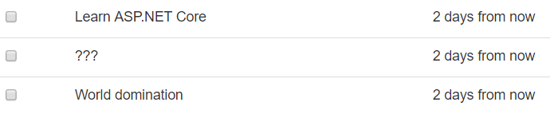

# Agregar paquetes externos
Una de las grandes ventajas de usar un ecosistema maduro como .NET es que el número de paquetes y plugins de terceros es enorme. Al igual que otros sistemas de paquetes, puedes descargar e instalar paquetes .NET que te ayudaran con casi cualquier tarea o problema que puedas imaginar.

NuGet es ambos, gestor de paquetes y el repositorio de paquetes oficial (en https://www.nuget.org). Puedes buscar paquetes en la web, e instalarlos desde tu máquina local a través de la terminal (o Interfaz gráfica, si estas usando Visual Studio).

## Instalar el paquete Humanizer
El final del último capítulo, la aplicación de tareas mostraba las tareas de la siguiente manera:


La columna fecha está mostrando fechas en un formato que es bueno para las máquinas (llamado IS0 8601), pero ambiguo para humanos. ¿No sería mejor si simplemente leemos “X días a partir de hoy”?

Puedes escribir código por ti mismo para convertir una fecha en formato ISO 8601 en una cadena amigable para humanos, pero afortunadamente, hay una manera mucho más rápida.

El paquete Humanizer en NuGet soluciona este problema proporcionado métodos que pueden "humanizar" o reescribir casi cualquier cosa: fechas, horas, duraciones, números y así sucesivamente. Es un proyecto open source fantástico y útil que es publicado bajo la licencia permisiva MIT.

Para agregarlo a tu proyecto, ejecuta este comando en la terminal;

```
dotnet add package Humanizer
```

Si das una ojeada en el archivo del proyecto `AspNetCoreTodo.csproj` veras una nueva línea `PackageReference` que hace referencia a `Humanizer`.

## Usar Humanizer en la vista

Para usar un paquete en tu código, usualmente tienes que agregar un enunciado `using` que importa el paquete al principio del archivo

Debido a que Humanizar será usado para reescribir las fechas mostradas en la vista, puedes usarlo directamente en las vistas misma. Primero añade un enunciado `@using` al principio de la vista.

**Views/Todo/Index.cshtml**

```html
@model TodoViewModel
@using Humanizer

// ...
```

Después actualiza la línea que escribe la propiedad `DueAt` para usar el método `Humanize` del paquete Humanizer:

```html
<td>@item.DueAt.Humanize()</td>
```

Ahora las fechas son mucho más legibles.



Hay paquetes disponibles en NuGet para todo desde parsear un XML hasta aprendizaje automático para postear en Twitter. ASP.NET Core mismo, bajo el capo, no es más que una colección de paquetes de NuGet que son agregados a tu proyecto.

> El archivo de proyecto creado por `dotnet new mvc` incluye una sola referencia al paquete `Microsoft.AspNetCore.All` que es un "metapaquete" conveniente que hace referencia a todos los otros paquetes de ASP.NET Core que necesitas para un proyecto típico. De esta forma no tienes que tener cientos de referencias a paquetes en tu archivo de proyecto.

En el siguiente capítulo, usaras otro conjunto de paquetes de NuGet (un sistema llamado Entity Framework Core) para escribir código que interactúa con una base de datos.
