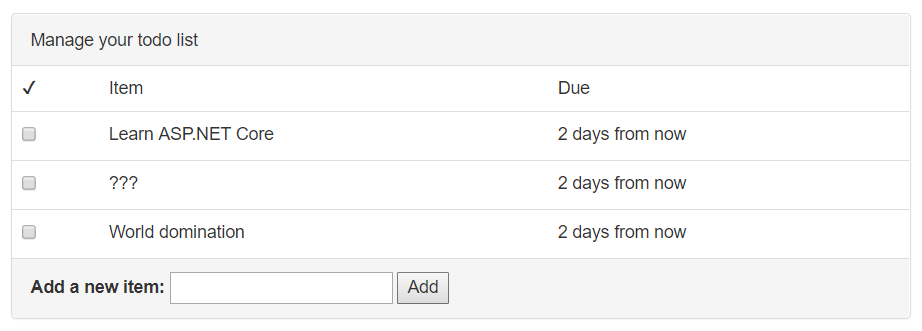

## Agregar nuevas tareas

El usuario agregará nuevas tareas con un simple formulario abajo de la lista



Para agregar esta característica requieres algunos pasos:

* Agregar un formulario a la vista
* Crear una nueva acción en el controlador para manipular el formulario.
* Agregar código a la capa de servicio para actualizar la base de datos.

### Agregar un formulario

La vista `Views/Todo/Index.cshtml` tiene un lugar asignado para el formulario para agregar elementos:

```html
<div class="panel-footer add-item-form">
  <!-- TODO: Add item form -->
</div>
```

Para mantener las cosas separadas y organizadas, crearas un formulario como una **vista parcial**. Una vista parcial es una pequeña pieza de una vista más grande que vive en un archivo separado.

Crea una vista llamada `AddItemPartial.cshtml`:

**Views/Todo/AddItemPartial.cshtml**

```html
@model TodoItem

<form asp-action="AddItem" method="POST">
    <label asp-for="Title">Add a new item:</label>
    <input asp-for="Title">
    <button type="submit">Add</button>
</form>
```

El tag helper `asp-action` puede generar una URL para el formulario, de forma similar cuando la usas en un elemento `<a>`. En este caso, el `asp-action` es remplazado con una ruta real hacia la acción `AddItem` que crearas:

```html
<form action="/Todo/AddItem" method="POST">
```

Agregar un tag-helper `asp-` al elemento `<form>` también agrega un campo oculto al formulario que contiene un código de verificación. Este código de verificación puede se usado para prevenir ataques solicitud de sitio cruzada. Verificarás el código cuando escribas la acción.

Esto toma responsabilidad de crear la vista parcial. Ahora, haz una referencia a esta desde la vista principal Todo:

**Views/Todo/Index.cshtml**

```html
<div class="panel-footer add-item-form">
  @await Html.PartialAsync("AddItemPartial", new TodoItem())
</div>
```

### Agregar una acción

Cuando un usuario presiona el botón Add sobre el formulario que creaste, su navegador construirá un solicitud POST hacia `/Todo/AddItem` en tu aplicación. Que por el momento no funcionara, porque no hay una acción que pueda manejar la ruta `/Todo/AddItem`. Si intentas ahora, ASP.NET Core regresara un error `404 Not Found`

Necesitaras crear una nueva acción llamada `AddItem` en el `TodoController`:

```csharp
[ValidateAntiForgeryToken]
public async Task<IActionResult> AddItem(TodoItem newItem)
{
    if (!ModelState.IsValid)
    {
        return RedirectToAction("Index");
    }

    var successful = await _todoItemService.AddItemAsync(newItem);
    if (!successful)
    {
        return BadRequest("Could not add item.");
    }

    return RedirectToAction("Index");
}
```

¿Notas como la nueva acción `AddItem` acepta un parámetro `TodoItem`? Es es el mismo modelo `TodoItem` que creaste en el capítulo _Fundamentos de MVC_ para guardar la información acerca de la tarea. Cuando es usado aque como un parámetro de acción, ASP.NET Core automáticamente ejecuta un proceso llamado **model binding**.

Model binding busca en los datos de la solicitud e intente inteligentemente coincidir los datos con las propiedad del modelo. En otras palabras, cuando el usuario envía el formulario y su navegador POST hacia esta acción, ASP.NET Core obtendrá esta información desde el formulario y la colocara en la variable `newItem`.

El atributo `[ValidateAntiForgeryToken]` antes de la acción le dice a ASP.NET Core que est debe buscar (y verificar) el código oculto de verificación qu fue agregado al formulario por el tag helper `asp-action`. Este es una importante medida de seguridad para prevenir falsificación de petición en sitios cruzados. donde tus usuario no puedes ser engañados enviando los datos del formulario a sitios maliciosos. El código de verificación se asegura que la aplicación es actualmente la única que muestra el formulario y recibe los datos del formulario.

Echa un vistazo `AddItemPartial.cshtml` a la vista una vez más. La linea `@model TodoItem` al principio del archivo le dice a ASP.NET Core que la vista debe esperar ser pareada con el modelo `TodoItem`. Esto hace posible usar `asp-for="Title"` en la etiqueta `<input>` para dejar ASP.NET Core conozca que esta elemento input es para la propiedad `Title`.

Porque la línea `@model`, la vista parcial espeta recibir un objecto `TodoItem` cuando es generada. Pasando a esta un `new TodoItem` a través `Html.PartialAsync` inicializa el formulario con una tarea en blanco.(Intenta añadir `{ Title = "hello" }` y ve que pasa!)

Durante el model binding, cualquier propiedad del model que no pueden se coincidente con los campos en la solicitud. Desde que el formulario solo incluye un elemento input `Title`, puede espera que las otras propiedades en `TodoItem` (la bandera `IsDone`, la fecha de `DueAt`) serán vacías o contienes valores predefinidos.

> En lugar de reutilizar el modelo `TodoItem`, otra aproximación seria crear un modelo separado (como `NewTodoItem` ) que solo es usado para esta acción y solo tiene las propiedades específicas (Titulo) que necesitas para agregar una nueva tarea. Enlazamiento de modelo es aun usar, pero de esta forma haz separado el modelo que es usado para guardar una tarea en la base de datos desde el modelo que es usado para enlazar la solicitud de entrada. Es a veces llamado un **binding model** or a **data transfer object**

Después de enlazar los dato de la solicitud al modelo, ASP.NET Core también ejecuta **validación del modelo**. La validación verifica si los datos en el modelo desde la solicitud de entrada hacen sentidos o es validad. Tu puedes agregar atributos a el modelo para decirle ASP.NET Core como debe ser validado.

El atributo `[Required]` en el titulo le dice al validador del modelo de ASP.NET Core considera el titulo invalido si no esta o esta en blanco. Dale un vistazo al código de la acción `AddItem`: el primer bloque checa si el `ModelState`es valido.(el resultado de la validación del modelo). Es opcional hacer esta verificación de validación justo en el principio de la acción:

```csharp
if (!ModelState.IsValid)
{
    return RedirectToAction("Index");
}
```

Si el `ModelState` es invalido por cualquier razón, el navegador será redireccionado a la ruta `/Todo/Index`, la cual refresca la página.

Después, el controlador llama a la capa de servicio para realizar la operación de base de datos actual de guardar la nueva tarea:

```csharp
var successful = await _todoItemService.AddItemAsync(newItem);
if (!successful)
{
    return BadRequest(new { error = "Could not add item." });
}
```

El método `AddItemAsync` regresa `true` or `false` dependiendo el clic, a es item fue agregado satisfactoriamente a la base. Si este falla por alguna razón, la acción regresará un error HTTP `400 Bad Request` junto con el objeto que contiene un mensaje de error.

Finalmente, si todo es completado sin errores, la acción redirige el navegador a la ruta `/Todo/Index`, la cual refresca la página y muestra la nueva, actualizar la listas de tareas de cada usuario.

### Agregar un método de servicio

Si estas usando un editor de código que entiende C#, veras unas líneas en rojas bajo `AddItemAsync` debido a que el método no existe aun.

Como ultimo paso, necesitas agregar un método a la capa de servicio. Primero agregalo a la definición de la interfaz en `ITodoItemService`:

```csharp
public interface ITodoItemService
{
    Task<TodoItem[]> GetIncompleteItemsAsync();

    Task<bool> AddItemAsync(TodoItem newItem);
}
```

Despues, la implementación actual en `TodoItemService`:

```csharp
public async Task<bool> AddItemAsync(TodoItem newItem)
{
    newItem.Id = Guid.NewGuid();
    newItem.IsDone = false;
    newItem.DueAt = DateTimeOffset.Now.AddDays(3);

    _context.Items.Add(newItem);

    var saveResult = await _context.SaveChangesAsync();
    return saveResult == 1;
}
```

La propiedad `newItem.Title` ya ha sido configurada por el enlazador de modelos de ASP.NET Core, asi este método solo necesita asignar un Id y confiar el valor por omisión para las otras propiedades. Entonces, la nueva tarea es agregadas al contacto de base de datos. Esta no se guarda hasta que llamas al método `SaveChangesAsync()`. Si el operación de guardar fue satisfactorio `SaveChangesAsync()` regresará 1.

### Pruebaló

Ejecuta la aplicación y agrega algunas tareas a tu lista mediante el formulario. Debido a que las tareas son almacenadas en la base de datos, estas estarán ahí incluso después de detener e iniciar la aplicación otra vez.

> Como un reto extra, intenta agregar un date picker usando HTML y Javascript y deja que el usuario elija una fecha (opcional) para la propiedad `DueAt`. Entonces usa, esa fecha en lugar de siempre hacer que una nueva tarea tenga fecha de entrega en 3 días.
