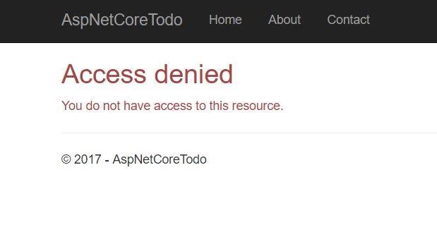

## Autorización con roles

Los roles son un enfoque común para el manejo de permisos y autorizaciones en una aplicación web. Por ejemplo, es común crear una rol de administrador que otorgue a los usuarios administradores más permisos o poder que los usuarios normales.

En este proyecto, agregará una página para Administrar usuarios que solo los administradores pueden ver. Si los usuarios normales intentan acceder a él, verán un error.

### Agregar una página Administrar usuarios

Primero, crea un nuevo controlador:

**Controllers/ManageUsersController.cs**

```csharp
using System;
using System.Linq;
using System.Threading.Tasks;
using Microsoft.AspNetCore.Mvc;
using Microsoft.AspNetCore.Authorization;
using Microsoft.AspNetCore.Identity;
using AspNetCoreTodo.Models;
using Microsoft.EntityFrameworkCore;

namespace AspNetCoreTodo.Controllers
{
    [Authorize(Roles = "Administrator")]
    public class ManageUsersController : Controller
    {
        private readonly UserManager<ApplicationUser>
            _userManager;
        
        public ManageUsersController(
            UserManager<ApplicationUser> userManager)
        {
            _userManager = userManager;
        }

        public async Task<IActionResult> Index()
        {
            var admins = (await _userManager
                .GetUsersInRoleAsync("Administrator"))
                .ToArray();

            var everyone = await _userManager.Users
                .ToArrayAsync();

            var model = new ManageUsersViewModel
            {
                Administrators = admins,
                Everyone = everyone
            };

            return View(model);
        }
    }
}
```

La configuración de la propiedad `Roles` en el atributo `[Authorize]`garantizará que el usuario tenga que iniciar sesión **y** se le asigne el rol de Administrador para poder ver la página.

A continuación, crea un modelo para la vista:

**Models/ManageUsersViewModel.cs**

```csharp
using System.Collections.Generic;

namespace AspNetCoreTodo.Models
{
    public class ManageUsersViewModel
    {
        public ApplicationUser[] Administrators { get; set; }

        public ApplicationUser[] Everyone { get; set;}
    }
}
```

Finalmente, cree una carpeta `Views/ManageUsers` y una vista para la acción `Index`:

**Views/ManageUsers/Index.cshtml**

```html
@model ManageUsersViewModel

@{
    ViewData["Title"] = "Manage users";
}

<h2>@ViewData["Title"]</h2>

<h3>Administrators</h3>

<table class="table">
    <thead>
        <tr>
            <td>Id</td>
            <td>Email</td>
        </tr>
    </thead>
    
    @foreach (var user in Model.Administrators)
    {
        <tr>
            <td>@user.Id</td>
            <td>@user.Email</td>
        </tr>
    }
</table>

<h3>Everyone</h3>

<table class="table">
    <thead>
        <tr>
            <td>Id</td>
            <td>Email</td>
        </tr>
    </thead>
    
    @foreach (var user in Model.Everyone)
    {
        <tr>
            <td>@user.Id</td>
            <td>@user.Email</td>
        </tr>
    }
</table>
```

Inicie la aplicación e intente acceder a la ruta `/ManageUsers` mientras esté conectado como un usuario normal. Verás esta página de acceso denegado:



Eso es porque a los usuarios no se les asigna automáticamente el rol de Administrador.


### Crear una cuenta de administrador de prueba

Por razones obvias de seguridad, no es posible que nadie registre una nueva cuenta de administrador. De hecho, el rol de administrador ni siquiera existe en la base de datos todavía.

Puede agregar el rol de administrador más una cuenta de administrador de prueba a la base de datos la primera vez que se inicie la aplicación. Agregar datos por primera vez a la base de datos se llama inicializar o **sembrar** la base de datos.

Crea una nueva clase en la raíz del proyecto llamada `SeedData`:

**SeedData.cs**

```csharp
using System;
using System.Linq;
using System.Threading.Tasks;
using AspNetCoreTodo.Models;
using Microsoft.AspNetCore.Identity;
using Microsoft.EntityFrameworkCore;
using Microsoft.Extensions.DependencyInjection;

namespace AspNetCoreTodo
{
    public static class SeedData
    {
        public static async Task InitializeAsync(
            IServiceProvider services)
        {
            var roleManager = services
                .GetRequiredService<RoleManager<IdentityRole>>();
            await EnsureRolesAsync(roleManager);

            var userManager = services
                .GetRequiredService<UserManager<ApplicationUser>>();
            await EnsureTestAdminAsync(userManager);
        }
    }
}
```

El método `InitializeAsync()` utiliza un `IServiceProvider` (la colección de servicios que se configura en el método `Startup.ConfigureServices()`) para obtener el `RoleManager` y el `UserManager` de ASP.NET Core Identity.

Agregue dos métodos más debajo del método `InitializeAsync()`. Primero, el método `VerifyRolesAsync()`:


```csharp
private static async Task EnsureRolesAsync(
    RoleManager<IdentityRole> roleManager)
{
    var alreadyExists = await roleManager
        .RoleExistsAsync(Constants.AdministratorRole);
    
    if (alreadyExists) return;

    await roleManager.CreateAsync(
        new IdentityRole(Constants.AdministratorRole));
}
```

Este método verifica si existe un rol de `Administrador` en la base de datos. Si no, crea uno. En lugar de escribir repetidamente la cadena `"Administrador"`, cree una pequeña clase llamada `Constants` para mantener el valor:

**Constants.cs**

```csharp
namespace AspNetCoreTodo
{
    public static class Constants
    {
        public const string AdministratorRole = "Administrator";
    }
}
```

> Si lo desea, puede actualizar el `ManageUsersController` para usar este valor constante también.

A continuación, escriba el método `EnsureTestAdminAsync()`:

**SeedData.cs**

```csharp
private static async Task EnsureTestAdminAsync(
    UserManager<ApplicationUser> userManager)
{
    var testAdmin = await userManager.Users
        .Where(x => x.UserName == "admin@todo.local")
        .SingleOrDefaultAsync();

    if (testAdmin != null) return;

    testAdmin = new ApplicationUser
    {
        UserName = "admin@todo.local",
        Email = "admin@todo.local"
    };
    await userManager.CreateAsync(
        testAdmin, "NotSecure123!!");
    await userManager.AddToRoleAsync(
        testAdmin, Constants.AdministratorRole);
}
```

Si no hay un usuario con el nombre de usuario `admin@todo.local` en la base de datos, este método creará uno y le asignará una contraseña temporal. Después de iniciar sesión por primera vez, ¡debe cambiar la contraseña de la cuenta a algo seguro!

A continuación, debe indicar a su aplicación que ejecute esta lógica cuando se inicie. Modifique `Program.cs` y actualice `Main()`para llamar a un nuevo método, `InitializeDatabase()`:

**Program.cs**

```csharp
public static void Main(string[] args)
{
    var host = BuildWebHost(args);
    InitializeDatabase(host);
    host.Run();
}
```

Luego, agregue el nuevo método a la clase debajo de `Main()`:

```csharp
private static void InitializeDatabase(IWebHost host)
{
    using (var scope = host.Services.CreateScope())
    {
        var services = scope.ServiceProvider;

        try
        {
            SeedData.InitializeAsync(services).Wait();
        }
        catch (Exception ex)
        {
            var logger = services
                .GetRequiredService<ILogger<Program>>();
            logger.LogError(ex, "Error occurred seeding the DB.");
        }
    }
}
```

Agregue esta declaración `using` al principio del archivo:

```csharp
using Microsoft.Extensions.DependencyInjection;
```

Este método obtiene la colección de servicios que necesita `SeedData.InitializeAsync()` y luego ejecuta el método para inicializar la base de datos. Si algo sale mal, se registra un error.

> Como `InitializeAsync()` devuelve un `Task`, el método `Wait()`debe usarse para asegurarse de que finaliza antes de que la aplicación se inicie. Normalmente utilizarías "esperar" para esto, pero por razones técnicas no puedes usar "esperar" en la clase "Programa". Esta es una rara excepción. ¡Debes usar `await` en cualquier otro lugar!

Cuando inicie la aplicación a continuación, la cuenta `admin@todo.local` se creará y se le asignará el rol de Administrador. Intente iniciar sesión con esta cuenta y navegue a `http://localhost:5000/ManageUsers`. Verás una lista de todos los usuarios registrados para la aplicación.

> Como desafío adicional, intente agregar más funciones de administración a esta página. Por ejemplo, podría agregar un botón que le dé a un administrador la posibilidad de eliminar una cuenta de usuario.

### Verificar la autorización en una vista

El atributo `[Authorize]` facilita la verificación de autorización en un controlador o método de acción, pero ¿qué sucede si necesita verificar la autorización en una vista? Por ejemplo, sería bueno mostrar un enlace "Administrar usuarios" en la barra de navegación si el usuario que ha iniciado sesión es un administrador.

Puede inyectar el `UserManager` directamente en una vista para realizar estos tipos de comprobaciones de autorización. Para mantener sus vistas limpias y organizadas, cree una nueva vista parcial que agregará un elemento a la barra de navegación en el diseño:

**Views/Shared/_AdminActionsPartial.cshtml**

```html
@using Microsoft.AspNetCore.Identity
@using AspNetCoreTodo.Models

@inject SignInManager<ApplicationUser> signInManager
@inject UserManager<ApplicationUser> userManager

@if (signInManager.IsSignedIn(User))
{
    var currentUser = await userManager.GetUserAsync(User);

    var isAdmin = currentUser != null
        && await userManager.IsInRoleAsync(
            currentUser,
            Constants.AdministratorRole);

    if (isAdmin)
    {
        <ul class="nav navbar-nav navbar-right">
            <li>
                <a asp-controller="ManageUsers" 
                   asp-action="Index">
                   Manage Users
                </a>
            </li>
        </ul>
    }
}
```

> Es una convención nombrar vistas parciales compartidas que comienzan con un guión bajo `_`, pero no es obligatorio.

Esta vista parcial primero utiliza el `SignInManager` para determinar rápidamente si el usuario está conectado. Si no lo está, el resto del código de vista se puede omitir. Si hay **hay** un usuario conectado, el `UserManager` se utiliza para buscar sus detalles y realizar una verificación de autorización con `IsInRoleAsync()`. Si todas las comprobaciones son correctas y el usuario es un administrador, se agrega un enlace **Administrar usuarios** a la barra de navegación.

Para incluir este parcial en el diseño principal, edite `_Layout.cshtml` y agréguelo a la sección de la barra de navegación:

**Views/Shared/_Layout.cshtml**

```html
<div class="navbar-collapse collapse">
    <ul class="nav navbar-nav">
        <!-- existing code here -->
    </ul>
    @await Html.PartialAsync("_LoginPartial")
    @await Html.PartialAsync("_AdminActionsPartial")
</div>
```

Cuando inicie sesión con una cuenta de administrador, ahora verá un nuevo elemento en la parte superior derecha:


