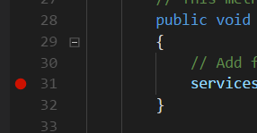
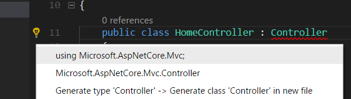

# Crear un proyecto de ASP.NET Core
Si todavía estas en el directorio creado para la aplicación Hello World, muévete a tu directorio Documentos o directorio inicial:

```text
cd ..
```

A continuación, crea un nueva carpeta para almacenar el proyecto completo y navega hacia el.

```text
mkdir AspNetCoreTodo
cd AspNetCoreTodo
```

A continuación, crea un nuevo proyecto con `dotnet new`, esta vez utilizaras opciones adicionales:

```text
dotnet new mvc --auth Individual -o AspNetCoreTodo
cd AspNetCoreTodo
```

Esto crea un nuevo proyecto usando la plantilla `mvc` y agrega al proyecto código adicional para la autenticación y seguridad (Cubrieré la seguridad en el capítulo _Seguridad e identidad_).

> Te preguntaras porque tener un directorio llamado `AspNetCoreTodo` dentro de otro directorio con el mismo nombre. El directorio principal o directorio raíz puede contener uno o más directorios de proyecto. El directorio raíz es a veces llamado el directorio de la solución. Después, agregaras más directorios de proyecto junto al directorio de proyecto AspNetCoreTodo. Todos en una solo directorio de la solución.

Verás unos pocos archivos en la carpeta del nuevo proyecto, Una vez que abres el nuevo directorio, todo lo que tienes que hacer para ejecutar el proyecto es:

```text
dotnet run

Now listening on: http://localhost:5000
Application started. Press Ctrl+C to shut down.
```

En lugar de imprimir en la consola y salir, este programa inicia un servidor web y espera peticiones en el puerto 5000.

Abre tu navegador web y navega a la dirección `http://localhost:5000`. Verás la pantalla de inicio predeterterminada de ASP.NET Core, lo cual significa que tu proyecto esta funcionando. Cuando termines presiona Contol-C en la terminal para detener el servidor.

## Las partes de un proyecto ASP.NET Core
La plantilla `dotnet new mvc` genera un gran número de archivos y directorio por ti. Aquí están las cosas más importantes que obtienes fuera de la caja:

* Los archivos **Program.cs** y **Startup.cs** configuraran el servidor web y la canalización de ASP.NET Core. La clase `Startup` es donde agregas el middleware que manipula y modifica los solicitudes de entrada y brindar cosas como archivos estáticos o páginas de errores. También en donde agregas tus propios servicios al contenedor de inyección de dependencias (posteriormente habrá más sobre esto).

* Los directorios **Models**, **Views** y **Controllers** contienen los componentes de la arquitectura Modelo Vista Controlador. Explorarás los tres en el siguiente capítulo.

* El directorio **wwwroot** contiene assets como archivos estáticos como CSS, Javascript e imágenes. Los archivos en `wwwroot` serán despachados como contenido estático y pueden ser empaquetados y minificados automáticamente.

* El archivo **appsettings.json** contiene los parámetros de configuración que la aplicación ASP.NET Core carga al inicio. Puedes almacenar aquí las cadenas de conexión u otras datos que no quieres que estén predefinidas en el código.

## Tips para Visual Studio Code

Si estas usando Visual Studio Code por primera vez, aquí tienes un par de tips de ayuda para iniciar:

* **Abrir el directorio raíz del proyecto**: En Visual Studio Code, selecciona Archivo > Abrir carpeta. Si Visual Studio Code te solicita instalar los archivos pendientes, presionar clic en **Si** para agregarlos.

* **F5 para ejecutar (y puntos de interrupción de depuración)**: Con tu proyecto abierto, presiona F5 pra ejecutar el proyecto en el modo de depuración. Esto es lo mismo que ejecutar `dotnet run` en la linea de comandos, pero tienes el beneficio de configurar puntos de interrupción en tu código dando doble clic en el margen izquierdo:



* **Foco para corregir problemas**: Si tu código contiene lineas rojos (errores del compilador, coloca el cursor sobre el código que esta en rojo y mirar el icono del foco encendido en el margen izquierdo. el foco te sugerirá reparaciones comunes, como agregar enunciados `using` faltantes en tu código:



* **Compila rápidamente**: Usa el atajo `Command-Shift-B` o `Control-Shift-B` para ejecutar la tarea de Build run la cual realiza lo mismo que `dotnet build`.

> Estos tips también aplican para Visual Studio (sin Code) en Windows. Si estas usando Visual Studio, necesitaras abrir el archivo de proyecto directamente. Visual Studio te solicitara guardar el archivo de la solución, el cuál debes guardar en el directorio raíz de la solución (la primera carpeta llamado `AspNetCoreTodo`). También puedes crear un proyecto ASP.NET Core directamente o en Visual Studio usando la plantillas disponibles en Archivo - Nuevo Proyecto.

### Una nota acerca de Git

Si usar Git o Github para manejar el control de código fuente, ahora es buen momento para hacer un `git init` e iniciar el repositorio en el directorio raíz del proyecto:

```text
cd ..
git init
```

Asegúrate que agregues un archivo `.gitignore` que ignora las carpeta `bin` y `obj`. La plantilla de .gitignore para Visual Studio en el repositorio de Github funciona genial.

Hay mucho más que explorar, así que profundicemos e iniciemos a desarrollar una aplicación.